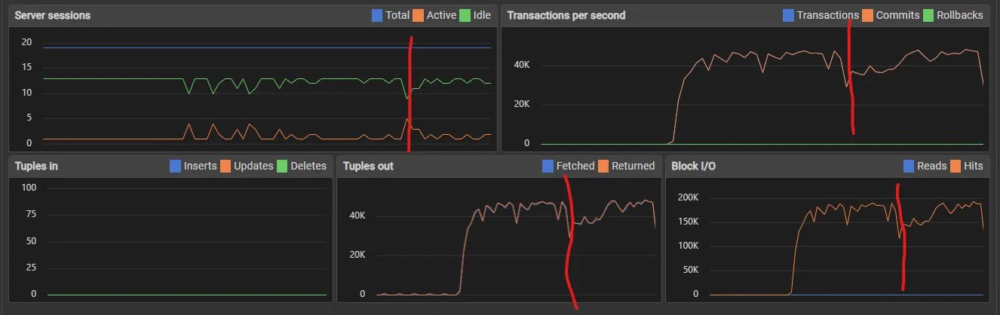

# Benchmark Notes

## Первые опорные результаты

**Стенд:** AMD Ryzen 5 3600

В ходе экспериментов с разным объёмом данных и RPS на `GET /{code}` остановился на **100к ссылок** в БД как базовой точке отсчёта.

---

### Схема нагрузки

| Фаза | Длительность | VU |
|---|---|---|
| Разгон | 30s | 200 |
| Удержание | 2m | 200 |
| Разгон | 30s | 500 |
| Удержание | 2m | 500 |
| Остывание | 10s | 0 |

---

### Результаты

#### Thresholds

| Метрика | Порог | Результат |
|---|---|---|
| `error_rate` | `< 1%` | ✅ 0.00% |
| `redirect_latency p(95)` | `< 200ms` | ✅ 68.41ms |
| `redirect_latency p(99)` | `< 500ms` | ✅ 113.19ms |

#### Латентность редиректа

| avg | min | med | p(90) | p(95) | p(99) | max |
|---|---|---|---|---|---|---|
| 38.06ms | 0ms | 34.92ms | 60.18ms | 68.41ms | 113.19ms | 3.6s |

#### Throughput

- **Проверок всего:** 2 620 860
- **Успешных:** 100% (все `status = 301`)
- **RPS:** ~8 500 req/s

---

### Выводы

Сервис уверенно держит ~8.5k RPS, p95 и p99 в норме. Выброс до 3.6s в max — вероятно, кратковременная просадка CPU в момент замера, не системная проблема.

**Загрузка CPU:** ~80% на 200 VU, ~90% на 500 VU. База данных при этом практически не нагружена.

_Красным выделен момент перехода с 200 на 500 VU — реакция минимальная._

**Вывод:** узкое место сейчас — CPU, который при каждом запросе ходит в БД.

**Гипотеза:** добавление Redis-кэша снизит нагрузку на CPU за счёт сокращения обращений к PostgreSQL.

---

## Следующий этап: 10М строк

Проанализировал данные bit.ly и других крупных сервисов — следующий тест будет на **10М ссылок**. Цель: проверить I/O-нагрузку и приблизиться к реальным объёмам сокращалок уровня средней аудитории.
